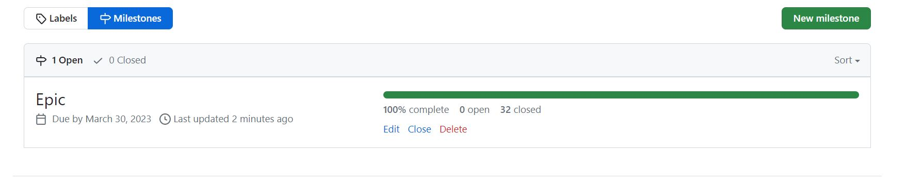
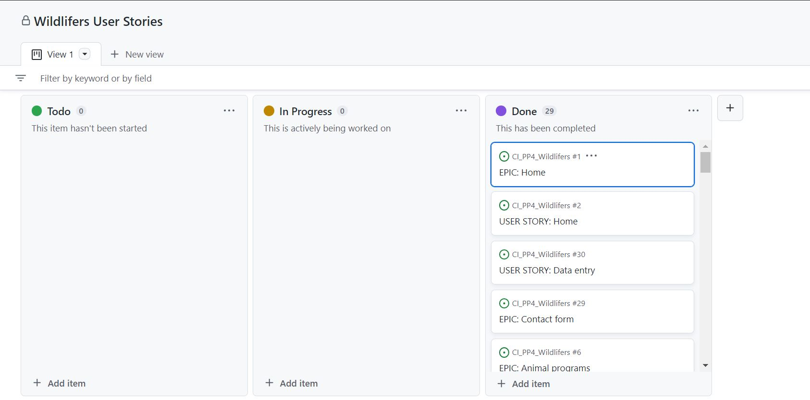

# Wildlifers
(Developer: Ewart Hestick)

[Live webpage]()

## Table of Contents
  - [About](#about)
  - [User Goals](#user-goals)
  - [Site Owner Goals](#site-owner-goals)
  - [User Experience](#user-experience)
  - [User Stories](#user-stories)
  - [Design](#design)
    - [Colours](#colours)
    - [Fonts](#fonts)
    - [Structure](#structure)
      - [Website pages](#website-pages)
      - [Database](#database)
    - [Wireframes](#wireframes)
  - [Technologies Used](#technologies-used)
  - [Features](#features)
  - [Validation](#validation)
  - [Testing](#testing)
    - [Manual testing of user stories](#manual-testing-of-user-stories)
    - [Automated testing](#automated-testing)
    - [Performing tests on various devices](#performing-tests-on-various-devices)
    - [Browser compatibility](#browser-compatibility)
  - [Bugs](#bugs)
  - [Configuration](#configuration)
    - [Google emails](#google-emails)
    - [Forking the GitHub Repository](#forking-the-github-repository)
    - [Making a Local Clone](#making-a-local-clone)
  - [Credits](#credits)
  - [Acknowledgements](#acknowledgements)

## About
- Wildlifers are a group dedicated to saving and aiding wild life.  We save and help native animals who are close to extinction or similar.  
 

### User Goals
- Learn more about wild life 
- Use site features to help prevent wildlife distinction
- Sign up for to be a memeber of site
- Enroll in site programs
- Contact the Organisation
- Write and comment on blog posts

### Site Owner Goals
- Make people aware of wild life distinction
- Offer programs that contribute to this
- Offer a blog for conversation and interaction amongst targeted audiences
- Get feedback form targeted audience

## User Experience

### Target Audience
- Wildlifers Targets animal lovers
- Enviroment activists
- Everyday working people who wants to but do not know how to contribute to the enviroment
- Everyday working people who wants to but do not know how to contribute to distinct animals
- 

### User Reqirements and Expectaions

- Accessible site
- Navigations that are simple and easy to use
- Site contact information
- Social media links
- Fully responsiveness

### User Stories

#### User 
1. As a site user I awnt to see a wild life scheme to site
2. As a user I want to have easy navigation to the site features 
3. As a site user have access to a list of animals of which I can register and help
4. As a site user I want to know how I can contribute
5. As a site user I want to be able to paginate through the list easily
6. As a site user I should have the option of enrolling in a program when I am reading about an 
  animal I like
7. As a site user I want to be able to register an account so I can enroll in a program
8. As a site user I want my registration information t be saved so that I only need to log in when I return
9. As a site user I want to be able to view a list of my current enrollments so I can plan for them
10. As a site user I want to be able to upade and change my enrollments
11. As a site user I want to be able to cancel any of my enrollments
12. As a site user I want to see messages when I enter, update or delete data entries  
18. As a site user I want o see a blog list
19. As a site user to want to read blog details
20. As a site user I want to have blog commenting options 
 
#### Returning User
 
 5. As  a return user I want the site to remember me

#### Site Owner 
13. As a site owner I want the user to be able to send us messages/emails through a contact form
14. As a site owner I want user to get messages when register, login , logout, enroll  
  in a program, edit enrollment, delete enroolment or send us messages through the contact form.
15. As a site owner I want user to have confirmantion action before canceling enrollments
16. T want user to see data entry vaildation when registering
17. I want site to be fully responsive  
21. As a owner I want to control commnets posted

### Kanban, Epics & User Stories
- GitHub Kanban was used to track all open user stories
- Epic was created using the milestones feature
- Mistaken all issues were load into one epic instead of seperate page Epics

Epic

User Story

Kanban

## Design

### Colour
 The color of the site was chosen to support the theme which is wild life, trees and animals. The dark navbar and footer helps to contrast the brightness of the colors.

### Fonts
The font was chosen from Google Font but I mostly used simple stanard font 

## Structure

### Website pages
This website was structured with the animal logo which give a wild life characteristic but also with the regular easy to use nav bar, a body of information and the regular footer which give the final characteristics of a funtional webpage.

The site Navbar is a black with a logo to to the lefzt which navigate to te home, links to the site pages on the right witha drop style nav which have links for registration, login and booking. At the bottom of the page there is the footer which contains office location informtion and social links.

- The site is consist of these pages:
 - Home page that contains information and images to share about wild life with 2 nav buttons to register and enroll in program.
 - The program page which display a paginated list of animals the programs represent, the status and option to read more about them 
 - A page to read more about the selected animal with a button to return to the aniaml list and a button to booking form
 - My bookings page if user is looged in shows a paginated list of that users enrollment programs with option buttons to edit or cancel the enrollment 
 - The contact us page display the contact form on which user can send us a message and also contain a map location of our Stockholm office
 - The blog page show a list of site blog post wth the option to view the blog
 - The blog page view show blog post details craeted date and comments, if the suer is logged in a comment for is present to allow suer to leave a comment on the post
 - The registration page displays the registration form for user to access and use site features
 - The login page displays a form to give return user an easier was to log in to sue site features
 - The Enroll page displays a for for users to make a booking with choices or date, time, animal, Jobs,etc. 

### Database

-

#### Usermodel
- This contains user information and was config by Django Allauth biult in library

#### Programsmodel
- animal_name(Foriegnkey)
- animal_category(Foriegnkey)
- country
- image
- description

#### Animalmodel
- name

#### Survivalcategorymodel
- category

#### Enrollmodel
- create_date
- start_date
- user
- name
- email
- volunteer_job
- work_time
- animal_name

#### Commentmodel
- post(Foriegnkey)
- name
- email
- body
- created_on
- approved

#### Postlistmodel
- title
- slug
- author(Foriegnkey)
- updated_on
- content
- feature_image
- excerpt
- created_on
- status

### Wireframes

Home

Program

Program Read

My Bookings

Booking Edit

Booking Cancel

Contact

Blog

Blog Details

Register

Login

Logout

Enroll

403

500

404 page

## Technologies Used

### Languages

- HTML
- CSS
- Javascript
- Python
- Django

### Libraries & Tools

- [Am I Responsive](http://ami.responsivedesign.is/)
- [Balsamiq](https://balsamiq.com/)
- [Bootstrap v5.2](https://getbootstrap.com/)
- [Cloudinary](https://cloudinary.com/)
- [Favicon.io](https://favicon.io)
- [Chrome dev tools](https://developers.google.com/web/tools/chrome-devtools/)
- [Font Awesome](https://fontawesome.com/)
- [Git](https://git-scm.com/)
- [GitHub](https://github.com/)
- [Google Fonts](https://fonts.google.com/)
- [Heroku Platform](https://id.heroku.com/login)
- [Postgres](https://www.postgresql.org/)
- [Summernote](https://summernote.org/)
- Validation:
  - [WC3 Validator](https://validator.w3.org/)
  - [Jigsaw W3 Validator](https://jigsaw.w3.org/css-validator/)
  - [JShint](https://jshint.com/)
  - [Pycodestyle(PEP8)](https://pypi.org/project/pycodestyle/)
  - [Lighthouse](https://developers.google.com/web/tools/lighthouse/)
  - [Wave Validator](https://wave.webaim.org/)

## Features

### Logo and Navigation Bar
- Site Logo supports the wild life theme of the site and navigates to home page 
- The navbar is consist of the logo and the links to all the site feature
- The navbar is present on all pages
- The navbar also have a drop down features login, register and booking
- The navbar switch to hamburger menu when use on smaller screens
- Fully responsive

See feature images

### Home page
- The home page is consist og images and descriptions relating to wildlife 
- The home page is also consist of a button to navigate to register and a button enroll
- Fully responsive

See feature images

 

### Footer
- The footer is consist of social media link
- The footer also have office location and contact information 
- the footer is displayed at the bottom of the page
- Fully responsive

See feature images

### Sign up/Register
- The registration page is consist of a form to enter user details
- It prupose is for new users to access more site features
- The form also instructions on how to register
- registered message will be seen
- Fully responsive

See feature images

### Login
- Easy for return users to get in
- Fields are mandatory
- Logged in messsage will be seen
- Fully responsive

See feature images

### Logout
- User can log out before leaving the site
- Logged out message will be seen
- Fully responsive

See feature images

### Program
- Information on what the program stands for
- Aniaml cards of feature animals with images aand animal status
- paginated for easy navogation
- Read button to get more details on the animal
- Programs can be added, edited and deleted by the staff/organization
- Fully responsive

See feature images

### Read program
- Here you find a more detailed information about the animal chosen
- There is a list on what you vcan do to help this animal
- There is a button to return to the list
- There is a button to go to enroolment form
- Fully responsive

See feature images

### User enrollment list
- Must be registered or logged in to see 
- Paginated list of user enrollment
- Each card are consist of a edit and cancel button
- Fully responsive

See feature images

### Enrollment editing
- Here is the enrollment form displaying the fields fill with the current booking and ready to be changed
- Submit and update message will be seen  
- Fully responsive

See feature images

### Cancel enrollment
- Here the canceling confirmation card is diaplayed
- The card have a button to return if user change their minds and a button tp cancel
- A confirmation message will be dispalyed when the canalation is completed
- Fully responsive

See feature images

### Contact page
- User can contact us by filling out this form
- User must enter their names and email and the message in the text field
- Message will display when the form is submitted
- Google map address is present for our office location
- Fully responsive

See feature images

### Blog
- Fully responsive
- Display blog posts made by staff/organisation
- Blog post are paginated
- Click on the post to read the post details

See feature images

### Blog details
- Blog details show more detials about the blog
- The featured image is displayed
- Fully responsive

See feature images

### Blog commenting
- only registered or logged in User get the option to leave comment
- Comment cand be done in the text field but needs to be approved
- When commented are made the submitted the comment awiting approval message is displayed 
- Comments are approved by staff/organisation for monitering purposes
- Fully responsive 

See feature images

### Booking
- Here the is the bookig form to enter your name and the aniaml, job. time and date User want to do their program
- Only registered or looged on user are allow to enroll in a program
- The form is made easier by displaying the list of Jobs, work times, animals and date picker
- There are also a descriptive list of the offered Jobs
- A con firmation messagge will display after for is submited
- Only registered or logged in User get the option to leave comment
- Comment cand be done in the text field but needs to be approved
- Fully responsive 

See feature images

## Validation

### HTML Validation
- The W3C Markup Validation Service was used to validate the HTML of the website.

Home

Program

Program details

My Booking

Booking Edit

Contact Us

Blog

Blog details

Register

Login

Logout

Enroll

403, 404, 500

### CSS Validation
- The W3C Jigsaw service was used for CSS Validation. 

style.css

### JavaSript Validation

- The JSHint JS Validation Service was used to validate the Javascript.

script.js

### Pep8 Validation

- PEP8 Validation Service was used to check the code for PEP8 requirements. 

#### Homeapp

tests.py

urls.py

view.py

#### Programsapp

admin.py

forms.py

models.py

tests.py

urls.py

view.py

#### Bookingapp

admin.py

forms.py

models.py

tests.py

urls.py

view.py

#### Blog app

admin.py

forms.py

models.py

tests.py

urls.py

view.py

### Chrome ligthouse tool

- Lighthouse was used to test the performance, accessibility, best practice and SEO of the site.

#### Mobile

View results

Page  | Performance (%) | Accessibility (%) | Best Practices (%) | SEO (%)
------------  | ------------ | ------------- | ------------- | -------------
home/templates/home/index.html | 92 | 100 | 100 | 100 |
home/templates/home/contact.html | 93 | 97 | 100 | 100 |
programs/templates/programs/programs.html | 98 | 100 | 100 | 100 |
programs/templates/programs/programs_list.html | 92 | 97 | 92 | 100 |
booking/templates/booking/bookings.html | 94 | 97 | 100 | 100 |
booking/templates/booking/enrollment_list.html | 97 | 98 | 100 | 100 |
booking/templates/booking/enrollment_editing.html | 94 | 98 | 92 | 100 |
booking/templates/booking/enrollment_delete.html | 98 | 93 | 100 | 100 |
blog/templates/blog/blog_list.html | 93 | 98 | 100 | 100 |
blog/templates/blog/blog_story.html | 97 | 98 | 100 | 100 |
templates/account/login.html | 98 | 100 | 92 | 100 |
templates/account/logout.html | 99 | 100 | 92 | 100 |
templates/account/signup.html | 99 | 100 | 92 | 100 |

#### Desktop

View results

Page  | Performance (%) | Accessibility (%) | Best Practices (%) | SEO (%)
------------  | ------------ | ------------- | ------------- | -------------
home/templates/home/index.html | 99 | 100 | 92 | 100 |
home/templates/home/contact.html | 100 | 100 | 92 | 100 |
programs/templates/programs/programs.html | 100 | 100 | 92 | 100 |
programs/templates/programs/programs_list.html | 99 | 96 | 92 | 100 |
booking/templates/booking/bookings.html | 100 | 100 | 92 | 100 |
booking/templates/booking/enrollment_list.html | 100 | 93 | 92 | 100 |
booking/templates/booking/enrollment_editing.html | 100 | 93 | 92 | 100 |
booking/templates/booking/enrollment_delete.html | 100 | 93 | 92 | 100 |
blog/templates/blog/blog_list.html | 100 | 98 | 92 | 100 |
blog/templates/blog/blog_story.html | 100 | 98 | 92 | 100 |
templates/account/login.html | 100 | 100 | 92 | 90 |
templates/account/logout.html | 100 | 100 | 92 | 100 |
templates/account/signup.html | 100 | 100 | 92 | 100 |

Home

Program

Program details

My Booking

Booking Edit

Booking Cancel

Contact Us

Blog

Blog details

Register

Login

Logout

Enroll

403, 404, 500

### Waves
- The WAVE WebAIM web accessibility evaluation tool was used to test the websites accessibility.

#### Desktop

Home

Program

Program details

My Booking

Booking Edit

Booking Cancel

Contact Us

Blog

Blog details

Register

Login

Logout

Enroll

403, 404, 500

#### Mobile

Home

Program

Program details

My Booking

Booking Edit

Booking Cancel

Contact Us

Blog

Blog details

Register

Login

Logout

Enroll

403, 404, 500

### Performing tests on various devices 

- HP EllitBook
- Amazon fire table 7
- Samsung galaxy 20

### Browser compatability

- Tested on Goole Chrome
- Tested Micrsoft Edge
- Tested on Morzilla Firefox

## Testing

- The was done as follows:
1. Mannual testing
2. Automative testing

1. As a site user I awnt to see a wild life scheme to site

   | **Step** | **Expected result** | **Actual Result** |
   |-------------|------------|---------------------|
   | Visit page:https://wildlifers.herokuapp.com/| Home page tells about the wht the site represent with photos to match | Work as Expected | 

   

Screenshots

   
   

2. As a user I want to have easy navigation to the site features 

   | **Step** | **Expected result** | **Actual Result** |
   |-------------|------------|---------------------|
   | Click on 'Home' on navigation bar | Home page will load | Work as expected |
   | Click on 'Programs' on navigation bar | Programs page will load |  Work as expected |
   | Click on 'Enroll' on navigation bar | Enroll page/login will load if logged in |  Work as expected |
   | Click on 'Blog' on navigation bar | Blog page will load |  Work as expected |
   | Click on 'Get Registered' on navigation bar select 'Register' | Register page will load |  Work as expected |
   | Click on 'Get Registered' on navigation bar select 'Contact'| Contact page will load |  Work as expected |
   | Click on 'Get Registered' on navigation bar select 'My Bookings' | 'Must be logged in message'/Enrollment list will load  |  Work as expected |
   | Click on 'Logout' on navigation bar | Logout page will load |  Work as expected | 

     

Screenshots

     
     
     
     
     
     
     
     
     
     
     

3. As a site user have access to a list of animals of which I can register and help

   | **Step** | **Expected Result** | **Actual Result** |
   |------------|---------------------|-------------------|
   | Navigate to program page  | List of imaged animal cards are visible  | Works as expected |
   | Go through paginated list | Cards are paginated by 4 on different pages | Works as expected |
   | Clickread on card | aniaml detail will display with option to enroll or go back to list | Works as expected |
  
  
   
    

Screenshots

    
    

4.  As a site user I want to know how I can contribute 

   | **Step** | **Expected Result** | **Actual Result** |
   |------------|---------------------|-------------------|
   | Go to profram page | Description on how to contribute is visible | Works as expected |

    

Screenshots

    
    

5. As a site user I want to be able to paginate through the list easily
   | **Step** | **Expected Result** | **Actual Result** |
   |------------|---------------------|-------------------|
   | Go to the bottom of any list | pagaination nav present | Works as expected |
   | Clic on arrow | the next page of list will display | Works as expected |
    

Screenshots

    
    

6. As a site user I should have the option of enrolling in a program when I am reading about an animal I like   
   | **Step** | **Expected Result** | **Actual Result** |
   |------------|---------------------|-------------------|
   | Select animal card | animal description page present with an enroll button to the bottom | Works as expected |
   | Select Enroll on Navbar | Enroll page will be present | Works as expected |
    

Screenshots

     
    

7. As a site user I want to be able to register an account so I can enroll in a program

   | **Step** | **Expected Result** | **Actual Result** |
   |------------|---------------------|-------------------|
   | Go to Get registered click register | Registration page will be displayed | Works as expected |

  

Screenshots

     
     
  

8. As a site user I want my registration information to be saved so that I only need to log in when I return

   | **Step** | **Expected Result** | **Actual Result** |
   |------------|---------------------|-------------------|
   | 1 | 2 | Works as expected |
  

Screenshots

     
     
  

9.  As a site user I want to be able to view a list of my current enrollments so I can plan for them 

   | **Step** | **Expected Result** | **Actual Result** |
   |------------|---------------------|-------------------|
   | Got to 'Get Registered' click on 'My Bookings' | A list of User'e booking will display | Works as expected |
  

Screenshots

     
   

10. As a site user I want to be able to update and change my enrollments

   | **Step** | **Expected Result** | **Actual Result** |
   |------------|---------------------|-------------------|
   | Got to 'Get Registered' click on 'My Bookings' | A list of User'e booking will display, Bookings in list will have editing button | Works as expected |
   | Click 'Edit button' | Edit form will display with this enrollment information ready to be changed | Works as expected |
   | Click submit | Enrollment wil be updated with upkdate confirmation message present | Works as expected |
  

Screenshots

    
    
  

11. As a site user I want to be able to cancel any of my enrollments

    | **Step** | **Expected Result** | **Actual Result** |
    |------------|---------------------|-------------------|
    | Got to 'Get Registered' click on 'My Bookings' | A list of User'e booking will display, Bookings in list will have editing button | Works as expected |
    | Click 'Delete button' | delete confirmation modal will display | Works as expected |
    | Click Delete | Enrollment will delete and a enrollment delete message will display | Works as expected |
    

Screenshots

    
    

12.  As a site user I want to see messages when I enter, update or delete data entries

   | **Step** | **Expected Result** | **Actual Result** |
   |------------|---------------------|-------------------|
   | Submit Register form | Registered message will display | Works as expected |
   | Submit Loginform | Logged in message will display | Works as expected |
   | Submit update form | Updated message will display | Works as expected |
   | Sumit logout| Logged out message will display | Works as expected |
   | Submit delete Enrollment | Deleted message will display | Works as expected |
   | Submit Enrollmet | Enrolled message will display | Works as expected |

  

Screenshots

    
    
  

13.  As a site owner I want the user to be able to send us messages/emails through a contact form
    | **Step** | **Expected Result** | **Actual Result** |
    |------------|---------------------|-------------------|
    |  Got to 'Get Registered' click on 'Contact' | Contact form will be displayed with message field | Works as expected |

14. I want my site to be fully responsive

    |**Step** | **Expected Result** | **Actual Result**
    |------------ | ------------ | ------------ |
    |Change device screen size using chrome dev tools | The web functionality remains the same on various screen sizes | Works as expected |

    

Screenshot

    
    
    
    
    

15. I want a paginated list of exercises so that I can easily select an exercise to view

    |**Step** | **Expected Result** | **Actual Result**|
    |------------ | ------------ | ------------ |
    |Navigate to exercise page in the navigation bar | Displays the list of all exercises paginated by 12 | Works as expected |
    |Click on the '»' symbol to go to the next page | Displays next available page | Works as expected |
    |Click on the '' to jump to the last page | Displays last page | Works as expected  |
    |Click on the '«' symbol to go to the previous page | Displays previous available page | Works as expected |
    |Click on the '' to jump to the first page | Displays first page | Works as expected  |
    |Put a filter on exercises and select only exercises for legs from the body part filter and click 'Search' | Displays only exercises | matching the search criteria | Works as expected |
    |Test '' & '' symbols to jump to the last / first page | Displays last / first page available | Works as expected |

     

Screenshots

     
     

16. As a site owner want user to see data entry vaildation when registering
    |**Step** | **Expected Result** | **Actual Result**
    |------------ | ------------ | ------------ |
    |Click on the 'Log in' on the nav bar and 'Register' from the drop-down menu | Displays Registration page | Works as expected |
    |Input username shorter than 4 characters (eg. xyz) | Prevents registration. Shows warning message to lenghten username text  | Works as expected |
    |Input username which has already been taken (eg. Admin) | Prevents registration. Displays 'A user with that username already exists.' message | Works as expected |
    |Input incorrect format of email | Shows warning message to include '@' in the email. Prevents registration | Works as expected |
    |Input 'newuser12' password |  Prevents registration. Displays 'The password is too similar to the username' message | Works as expected |
    |Input '12345678' as a password | Prevents registration. Displays 'This password is entirely numeric' message | Works as expected |
    |Input 'testing' as a password | Prevents registration. Displays 'This password is too short. It must contain at least 8 characters' message | Works as expected |
    |Input two different values in 'Password' and 'Password (again)' fields | Prevents registration. Displays 'You must type the same password each time.' message | Works as expected |

    

Screenshots

    
    

17. As a site ownerI want site to be fully responsive 
    | **Step** | **Expected Result** | **Actual Result** |
    |------------|---------------------|-------------------|
    | 1 | 2 | Works as expected |
    

Screenshots

    
    

18. As a site user I want to see a blog list
    | **Step** | **Expected Result** | **Actual Result** |
    |------------|---------------------|-------------------|
    | Go to blog on navbar | A list of blog post will display | Works as expected |
    

Screenshots

    
    

19. As a site user to want to read blog details
    | **Step** | **Expected Result** | **Actual Result** |
    |------------|---------------------|-------------------|
    | Click on a blog image in blog list | Blog details will display | Works as expected |
    

Screenshots

    
    

20. As a site user I want to have blog commenting options 
    | **Step** | **Expected Result** | **Actual Result** |
    |------------|---------------------|-------------------|
    | Login, click on blog post | Comment form will display for commenting | Works as expected |
    

Screenshots

    
    

21. As a owner I want to control commnets posted
    | **Step** | **Expected Result** | **Actual Result** |
    |------------|---------------------|-------------------|
    | Comment  | 2 | Works as expected |
    

Screenshots

    
    

## Design

## Bugs
  List of bugs found and fixes used ti mitigate them.

- Bug: the first page had overflow to the right of the page.
  Fix: with from the slack community i was refered to unicorn revealer which showed my opentimes width was too much. Adjusted this and issue was fixed
- Bug: during accessibilty test my good practice points were low
  Fix: using the unicorn revealer again imanaged to find my logo image had margin space and my about us text had border radius value that were unneccessary. Adjusted these issues and my score got better
- Bug: during html validation signup.html error, signup form "for" value and "id" value were not matching  
    Fix: Change both value to the same which rectified error
- Bug: html validation for index.hmtl warnings for lack of heading h1-h6 in section tags
  Fix: removed unneccesary section tags
- Bug: html validation error for all html file h1-h6 heading, some sequence wer skipped h2-h4 and    h2-h5 
   Fix: changed heading tag for all html file to the correct sequences
- Bug: Wave error for color contrast on navbar and more about us button "deep orange and very dark blue"
  Fix: change to a slightly brighter orange to mitigate issue,
- Bug: Wave error for color conflicting contrast with cover text for the hero image on the home page
  Fix: Add a lite background overlay wrapped in a div tag to mitigate issue
- Bug: loading performance on the home page was low due to hero image loading time
  Fix: replaced hero-image 
- Bug: background image for the "Become a Member" page look streched with distorted pixels
  Fix: Replaced "Become a Member" page backgroung image
- Bug: hero image overlay half way over the image  onthe big screen and overflowing into the ethos section
   Fix: adjusted padding bottom and confirmed issue was no longer present

## Configuration

### Google emails

To set up the project to send emails and to use a Google account as an SMTP server, the following steps are required:

1. Create an email account at google.com, login, click you user icon and then on 'Manage Your Google Account'
2. Click on the Security tab
3. Turn on 2-step verification and follow the steps to enable
4. Click on App passwords, click on Select app and choose Other
5. Give your app a name and click on 'Generate'
   
6. A 16 digit password will be generated, note the password down
7. Set the below variables within the settings.py file to successfully send emails
   <code>EMAIL_BACKEND = 'django.core.mail.backends.smtp.EmailBackend'</code>
   <code>EMAIL_HOST = 'smtp.gmail.com'</code>
   <code>EMAIL_HOST_USER = os.environ.get('EMAIL_HOST_USER')</code>
   <code>EMAIL_HOST_PASSWORD = os.environ.get('EMAIL_HOST_PASSWORD')</code>
   <code>EMAIL_PORT = '587'</code>
   <code>EMAIL_USE_TLS = True</code>
8. Set up the variables EMAIL_HOST_USER and EMAIL_HOST_PASSWORD in your Render application Config vars

## Deployment

### Heroku
This application has been deployed from GitHub to Heroku by following the steps:

### Forking the GitHub Repository
1. Go to the GitHub repository
2. Click on Fork button in top right corner
3. You will then have a copy of the repository in your own GitHub account.
   
### Making a Local Clone
1. Go to the GitHub repository 
2. Locate the Code button above the list of files and click it
3. Highlight the "HTTPS" button to clone with HTTPS and copy the link
4. Open Git Bash
5. Change the current working directory to the one where you want the cloned directory
6. Type git clone and paste the URL from the clipboard ($ git clone https://github.com/YOUR-USERNAME/YOUR-REPOSITORY)
7. Press Enter to create your local clone

[Back to Table Of Contents](#table-of-content)

### Heroku Deployment

[Official Page](https://devcenter.heroku.com/articles/git) (Ctrl + click)

This application has been deployed from Github using Heroku. Here's how:

1. Create an account at heroku.com

2. Create an app, give it a name for such as ci-pp4-the-diplomat, and select a region

3. Under resources search for postgres, and add a Postgres database to the app

Heroku Postgres

1. Note the DATABASE_URL, this can be set as an environment variable in Heroku and your local deployment(env.py)

2. Install the plugins dj-database-url and psycopg2-binary.

3. Run pip3 freeze > requirements.txt so both are added to the requirements.txt file

4. Create a Procfile with the text: web: gunicorn the_diplomat.wsgi

5. In the settings.py ensure the connection is to the Heroku postgres database, no indentation if you are not using a seperate test database.
I store mine in env.py

6. Ensure debug is set to false in the settings.py file

7. Add localhost, and wildlifers.herokuapp.com to the ALLOWED_HOSTS variable in settings.py

8. Run "python3 manage.py showmigrations" to check the status of the migrations

9. Run "python3 manage.py migrate" to migrate the database

10. Run "python3 manage.py createsuperuser" to create a super/admin user

11. Run "python3 manage.py loaddata categories.json" on the categories file in products/fixtures to create the categories

12. Run "python3 manage.py loaddata products.json" on the products file in products/fixtures to create the products

13. Install gunicorn and add it to the requirements.txt file using the command pip3 freeze > requirements.txt

14. Disable collectstatic in Heroku before any code is pushed using the command heroku config:

15. Ensure the following environment variables are set in Heroku

16. Connect the app to GitHub, and enable automatic deploys from main if you wish

17. Click deploy to deploy your application to Heroku for the first time

18. Click on the link provided to access the application

19. If you encounter any issues accessing the build logs is a good way to troubleshoot the issue

## Credits

### Media

Media images were referenced from <a href="https://www.pexels.com/">Pexels</a> , <a href="https://unsplash.com/">Upsplash</a> and <a href="http://www.freepik.com/">Freepik</a>. 

- [404-background](assets/images/404er.jpeg): <a href=" https://www.pexels.com/photo/an-apple-and-a-dumbbell-on-a-clipboard-8154260/" >Pexels</a>
  Photo by:  <a href="https://www.pexels.com/@alesiakozik/">Alesia Kozik</a>
- [signup-page-background](assets/images/signupimage.jpeg): <a href="https://www.pexels.com/photo/          personal-male-trainer-with-overweight-female-client-in-fitness-center-6455927/">Pexels</a>
  Photo by:  <a href="https://www.pexels.com/@julia-larson/">Julian Larson</a>
- [hero-image](assets/images/heroimage.jpg): <a href="https://www.freepik.com/premium-photo/sport-couple-doing-plank-exercise-workout-fitness-centrum-man-woman-practicing-plank-gym_17801349.htm">Freepik</a>
  Photo by: <a href= "https://www.freepik.com/author/weyo">Weyo</a>
- [crossfit-image](assets/images/crossfitsmall.jpg): <a href="https://unsplash.com/photos/h3D-RRvxfqE">Unsplash</a>
  Photo by: <a href="https://unsplash.com/@bastien_plu">Bastien Plu</a>
- [trainer-image](assets/images/trainer.jpeg): <a href="https://www.pexels.com/photo/ethnic-woman-exercising-with-battling-ropes-near-male-trainer-6455771/">Pexels</a>
  photo by: <a href= "https://www.pexels.com/@julia-larson/">Julian Larson</a>

### Code
 - My HTML code from lessons and formats from the html module and walk through project which then evolved into my owm structure as i gain more knowledge by trail and error.
 - My CSS code was also built on the concept of trail and error, google W3School wedsite tips.

## Acknowledgements
- Tanks and acknowlegement goes to my mentor Mo Shami great guidance.
- Acknowledge my brother Addan Mc Collin for support form a user's veiw
- Thanks to my girlfriend Hiba Salem for support and input on a user veiw
- Thankful to the Slack team for tips